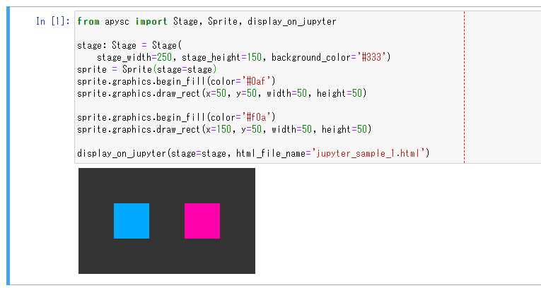
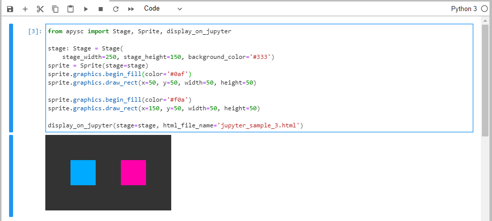

# display_on_jupyter interface

This page explains the `display_on_jupyter` function interface.

## What interface is this?

The `display_on_jupyter` interface displays the apysc HTML on the Jupyter.

## Requirements

This interface requires the Jupyter library. Therefore, if you haven't installed Jupyter, you need to install it before going on (e.g., `pip install notebook`).

For more information, please see:

- [Installing the Jupyter Software](https://jupyter.org/install)

Also, this interface uses the `IPython.display.IFrame` interface. If you encountered that interface error, please update the Jupyter version.

## Notes

- Jupyter on the VS Code is not supported currently (since the VS code restriction).
- Jupyter notebook and JupyterLab are supported.

## Basic usage

You can use the `display_on_jupyter` interface to display an output HTML instead of the `save_overall_html` function.

This interface requires the `html_file_name` argument to be unique if you need to output multiple HTML. Otherwise, this interface overwrites the HTML file:

```py
import apysc as ap

ap.Stage(stage_width=250, stage_height=150, background_color="#333")
sprite = ap.Sprite()
sprite.graphics.begin_fill(color="#0af")
sprite.graphics.draw_rect(x=50, y=50, width=50, height=50)

sprite.graphics.begin_fill(color="#f0a")
sprite.graphics.draw_rect(x=150, y=50, width=50, height=50)

ap.display_on_jupyter(html_file_name="jupyter_sample_1.html")
```



Also, this interface can use on the JupyterLab:



## display_on_jupyter API

<!-- Docstring: apysc._jupyter.jupyter_util.display_on_jupyter -->

<span class="inconspicuous-txt">Note: the document build script generates and updates this API document section automatically. Maybe this section is duplicated compared with previous sections.</span>

**[Interface signature]** `display_on_jupyter(html_file_name: str, *, minify: bool = True) -> None`<hr>

**[Interface summary]** Save the overall HTML and display it on the Jupyter.<hr>

**[Parameters]**

- `html_file_name`: str, default 'index.html'
  - The output HTML file name.
- `minify`: bool, default True
  - Boolean value whether minify a HTML or not. False setting is useful when debugging.

<hr>

**[Notes]**

Currently, this interface does not support Jupyter on the VS Code. This interface requires the Jupyter library (e.g., `notebook` package).